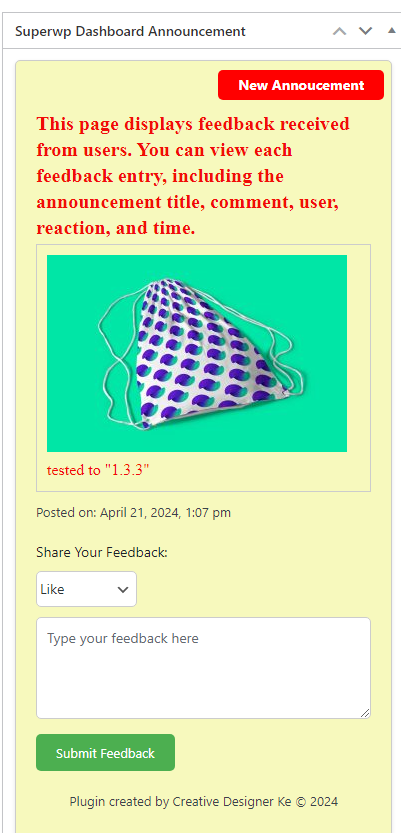
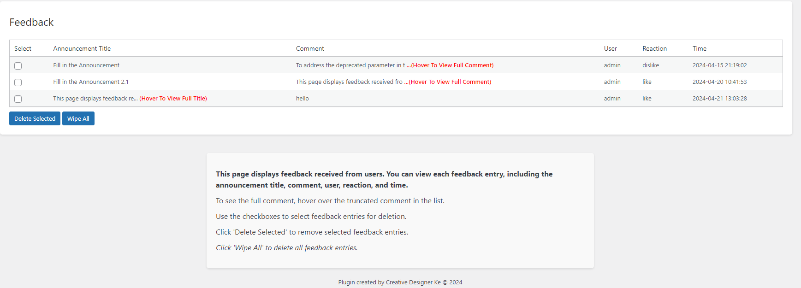
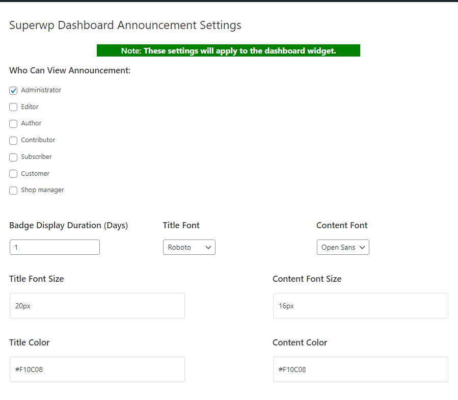

# Superwp Dashboard Announcement

Superwp Dashboard Announcement is a WordPress plugin that allows you to easily add custom announcements to your WordPress dashboard for all users.

## Features

- **Custom Announcements**: Display custom announcements on the WordPress dashboard.
- **Customization Options**: Customize the title, content, font, size, color, alignment, and background color of the announcement.
- **Collapsible Announcements**: Make announcements collapsible for user convenience.
- **User Role Targeting**: Display announcements to specific user roles.
- **New Announcement Badge**: Include a badge to indicate new announcements.
- **Fonts Integration**: Enqueue Fonts for custom font options.

## Installation

1. Go to `Plugins` in the Admin menu.
2. Click on `Add new`.
3. Search for `Superwp Dashboard Announcement` and click 'Install Now' or upload `superwp-dashboard-announcement.zip`.
4. Click on `Activate plugin`.

## Frequently Asked Questions

- **How do I customize the announcement?**: You can customize the announcement in the plugin settings.
- **Can I make the announcement collapsible?**: Yes, you can enable the collapsible option in the settings.
- **How do I display the announcement to specific user roles?**: Use the plugin settings to target specific user roles.
- **How do I change the duration for the new announcement badge?**: Adjust the duration in the plugin settings.
- **How do I enqueue Fonts for the announcement?**: Fonts are automatically enqueued based on your font selections in the settings.

## Upgrade Notice

- **1.3.05**: Ensure compatibility with the latest WordPress version and benefit from improvements and bug fixes.

## Screenshots

1. 
2. 
3. 
4. 

## Support

If you encounter any issues or have questions, feel free to [create an issue](https://github.com/Thiararapeter/Superwp-Dashboard-Announcement/issues).

[Donate To Support Superwp Dashboard Announcement](https://www.buymeacoffee.com/thiarara)

## Developer

Superwp Dashboard Announcement is developed and maintained by [Thiarara](https://profiles.wordpress.org/thiarara).
For contributions, suggestions, or issues, visit the [GitHub repository](https://github.com/Thiararapeter/Superwp-Dashboard-Announcement/issues).

## License

This plugin is licensed under the GPLv2 or later. See [License](https://www.gnu.org/licenses/gpl-2.0.html) for more information.
